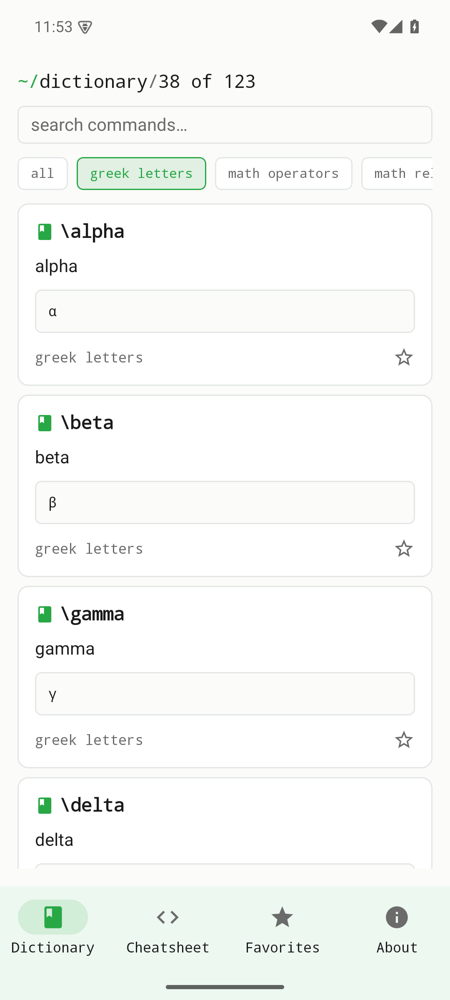

Une visite guidée d'Établi Plume v0.1.0, illustrée par de vraies captures d'écran de la version exécutée sur un appareil Android. Plume est une référence hors ligne et un sélecteur de snippets pour les commandes de composition : cherchez une commande, voyez le symbole rendu, copiez-le et marquez d'une étoile celles que vous utilisez souvent. Sans compte, sans réseau.

## Dictionnaire

L'appli s'ouvre sur le **Dictionnaire** — chaque commande avec son glyphe rendu, cherchable depuis la barre du haut. Le fil d'Ariane indique combien d'entrées correspondent (par exemple, `123 of 123`). Chaque carte porte une commande (`\alpha`), son nom, le symbole rendu (α), sa catégorie et une étoile pour la mettre en favori. Tapez dans **search commands…** pour filtrer la liste en direct.

{width=320}

## Filtre par catégorie

Les puces sous la zone de recherche filtrent par catégorie — **all · greek letters · math operators · math relations · …** — pour parcourir une famille à la fois. Ici la liste est réduite aux **lettres grecques**, ne laissant à l'écran que `\alpha`, `\beta`, `\gamma` et consorts.

{width=320}

## Favoris

Marquez d'une étoile les commandes que vous utilisez le plus et elles se regroupent dans les **Favoris** pour un accès en un geste. Cette vue reste courte et personnelle — la poignée de commandes que vous utilisez réellement, sans faire défiler tout le dictionnaire.

{width=320}

## Aide-mémoire

L'**Aide-mémoire** (Cheatsheet) est une vue d'ensemble dense et lisible d'un coup d'œil de tout le jeu de commandes, regroupé par catégorie — la vue « référence imprimée ». Il échange le détail par carte du Dictionnaire contre l'étendue, pour saisir de nombreuses commandes en un coup d'œil.

{width=320}

## À propos

La page **À propos** présente l'appli, son périmètre et la mention que Plume n'a aucune affiliation avec TeX ni le LaTeX Project. Plume est le renommage volontaire de l'ancien EtabliTeX ; les noms TeX/LaTeX relèvent de la TeX License de Knuth et de la LPPL.

{width=320}

## Distribution

Établi Plume v0.1.0 est une **version de développement Android uniquement**, distribuée sous forme d'APK signé via GitHub Releases :

- [Télécharger la v0.1.0 (APK signé)](https://github.com/etabli-dev/etabli-plume/releases/tag/v0.1.0)

Les versions App Store, Google Play et F-Droid sont prévues mais pas encore disponibles. Le code source est hébergé sur [`etabli-dev/etabli-plume`](https://github.com/etabli-dev/etabli-plume).
