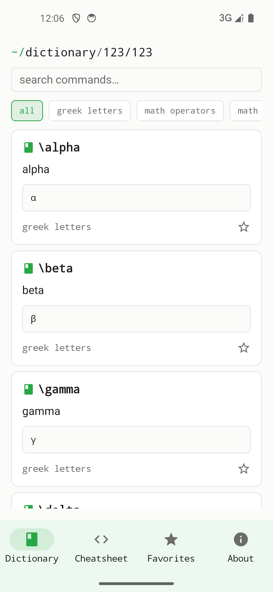

## Prérequis

- Un appareil iOS ou Android. Pas de compte, pas d'inscription, pas d'Internet.

## Configuration

1. Installer l'appli depuis le store et l'ouvrir.
2. On arrive directement sur la liste des catégories — pas de connexion.

{width=320}

## Trouver une commande

1. **Choisir une catégorie** (p. ex. « Opérateurs mathématiques »).
2. **Toucher une entrée.** Le panneau d'aperçu affiche la commande, une courte explication et un exemple d'usage typique.
3. **Copier dans le presse-papiers** — la commande est ensuite disponible pour collage à l'échelle du système.
4. Optionnellement **marquer en favori** pour la retrouver en haut de la vue Favoris à la prochaine ouverture.

## Remarques

- Plume est une **référence**, pas un compilateur LaTeX — il ne compile pas de documents, il aide à écrire.
- Les contenus sont entièrement embarqués dans l'appli ; tout est disponible sans réseau.
- Plume était auparavant publié sous le nom *EtabliTeX*. L'appli a été renommée pour ne pas suggérer d'affiliation avec TeX/LaTeX.
