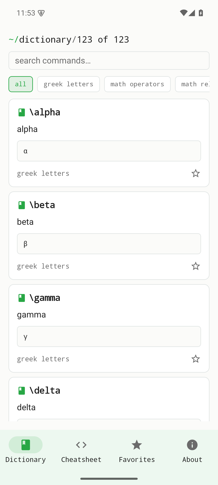
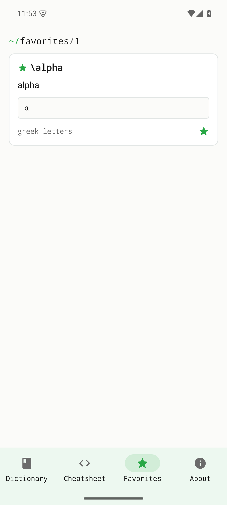
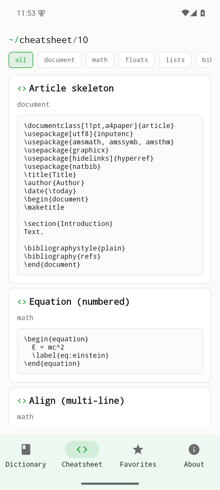
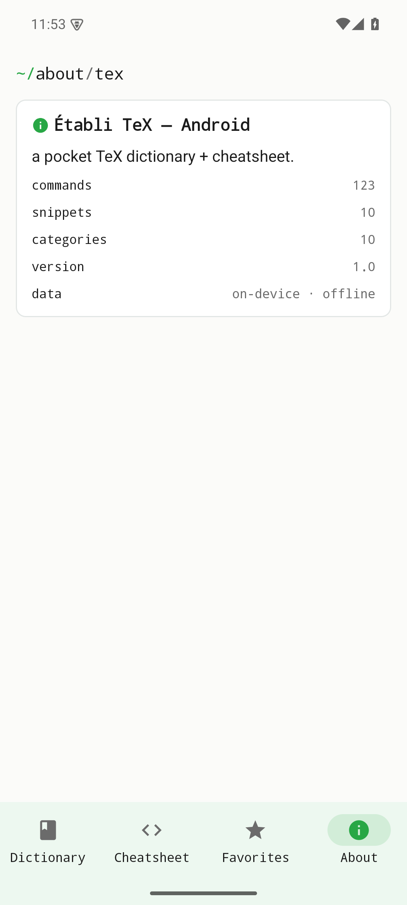

# Plume — Vignette & Tutorial (v0.1.0)

> **Établi Plume** is an offline reference and snippet-picker for typesetting
> commands — Greek letters, math operators and relations, formatting,
> environments, bibliography. Search a command, see the rendered symbol, copy it,
> and star the ones you reach for often. Fully offline; no accounts, no network.
>
> **Stack:** native Android (Kotlin + Jetpack Compose). Part of the **établi**
> suite, on the shared Coder design system (accent `#28A745`, JetBrains Mono).
> Figures are real screenshots of the v0.1.0 build on an Android emulator,
> regenerated by `scripts/capture.sh`.
>
> *Plume is the deliberate rename of the former EtabliTeX; unaffiliated with TeX
> or the LaTeX Project.*

## Table of contents
1. [Quick start](#quick-start)
2. [Dictionary](#feature-dictionary)
3. [Category filters](#feature-category-filters)
4. [Favorites](#feature-favorites)
5. [Cheatsheet](#feature-cheatsheet)
6. [About](#feature-about)
7. [Reproducing these figures](#reproducing-these-figures)
8. [Version](#version)

## Quick start
Install `plume-0.1.0.apk` and open it. It lands on the **Dictionary** — every
command with its rendered glyph, searchable from the top bar.



## Feature: Dictionary
The breadcrumb shows how many entries match (`123 of 123`). Each card is a
command (`\alpha`), its name, the rendered symbol (α), its category, and a star to
favourite it. Type in **search commands…** to filter live.


## Feature: Category filters
The chips below the search box filter by category — **all · greek letters · math
operators · math relations · …** — so you can browse one family at a time.


## Feature: Favorites
Star the commands you use most and they collect under **Favorites** for one-tap
access.



## Feature: Cheatsheet
**Cheatsheet** is a dense, scannable overview of the whole command set grouped by
category — the printed-reference view.



## Feature: About
**About** covers the app, its scope, and the unaffiliated-with-TeX note.



## Reproducing these figures
```bash
( cd android && ./gradlew :app:assembleDebug )
adb install -r android/app/build/outputs/apk/debug/app-debug.apk
bash scripts/capture.sh
```
Device: 1080×2400 @ 420dpi, animations disabled. Slugs in `scripts/capture.sh`
map 1:1 to the filenames above.

## Version
Documents établi **Plume v0.1.0** (applicationId `com.raban.etabli.tex`,
versionCode 1). Part of the établi (workbench) suite.
